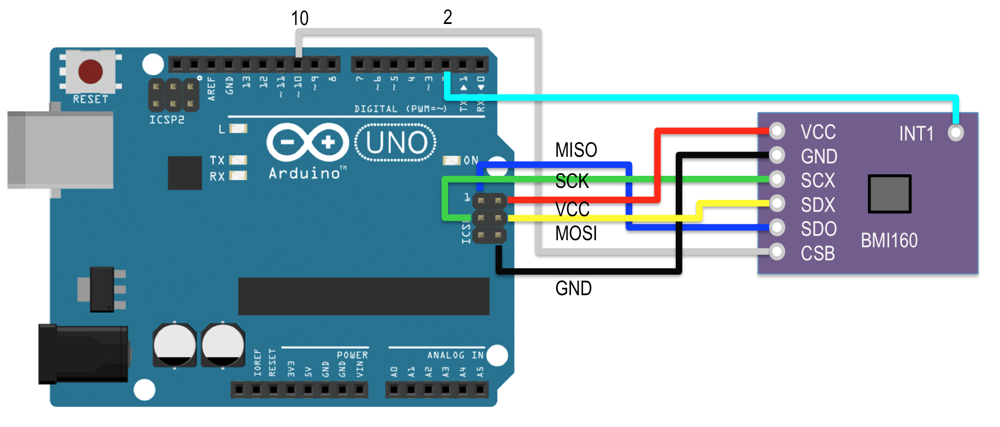
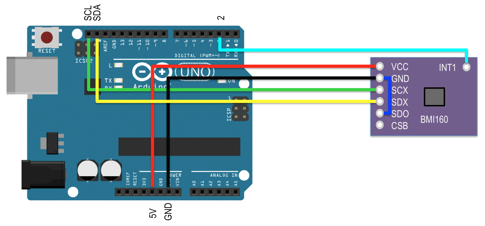

# BMI160-Arduino

This driver is for BMI160 6DoF sensor breakout boards which are connected through the Arduino SPI.
Derived from the Intel's CurieIMU driver for the Arduino/Genuino 101.

Intel's driver repository: https://github.com/01org/corelibs-arduino101/tree/master/libraries/CurieIMU

BMI160: https://www.bosch-sensortec.com/bst/products/all_products/bmi160

## How to install
Copy all files of this project to the your Arduino IDE library folder.

Example:
```
cp ~/github/BMI160-Arduino ~/Documents/Arduino/libraries/
```

## Get sensor board
You can find cheap breakout boards ($2~3 USD) on the eBay.
Pin names may vary by board vendors. I have two variations of BMI160 breakout board.


## Wiring

### SPI mode
You should connect some digital out pin to the CSB of the BMI160 and tell the number of the pin to the initialize method, begin().


### I2C mode
You should connect SDO/SA0 pin of the BMI160 to GND for default I2C address or tell the I2C address to the initialize method, begin().


## Example Code
```
#include <BMI160Gen.h>

const int irq_pin = 2;
const int i2c_addr = 0x69;

void setup() {
  Serial.begin(115200); // initialize Serial communication
  while (!Serial);    // wait for the serial port to open

  // initialize device
  //BMI160.begin(BMI160GenClass::SPI_MODE, select_pin);
  BMI160.begin(BMI160GenClass::I2C_MODE, i2c_addr, irq_pin);
}

void loop() {
  int gx, gy, gz;         // raw gyro values

  // read raw gyro measurements from device
  BMI160.readGyro(gx, gy, gz);

  // display tab-separated gyro x/y/z values
  Serial.print("g:\t");
  Serial.print(gx);
  Serial.print("\t");
  Serial.print(gy);
  Serial.print("\t");
  Serial.print(gz);
  Serial.println();

  delay(500);
}
```

## Compatibility

Board           |MCU         |tested works|doesn't work|not tested| Notes
----------------|------------|------------|------------|----------|-----
Arduino UNO     |ATmega328P  | X          |            |          | D2 pin for INT1
Arduino 101     |Intel Curie | X          |            |          |
Arduino Leonardo|ATmega32u4  | X          |            |          | D7 pin for INT1
Arduino M0 PRO  |ATSAMD21G   | X          |            |          | D7 pin for INT1
ESP32-Dev-Kit   |ESP32       | X          |            |          | D2 pin for INT1
Bluefruit52     |nRF52832    | X          |            |          | P0.30 pin for INT1

Other boards which have the same MCU might be work well.

## Arduino example

* [Accelerometer](https://github.com/Afantor/BMI160-Arduino/tree/master/examples/Accelerometer)  This sketch example demonstrates how the BMI160 on the Intel(R) Curie(TM) module can be used to read accelerometer data.
* [AccelerometerOrientation](https://github.com/Afantor/BMI160-Arduino/tree/master/examples/AccelerometerOrientation)  This sketch example demonstrates how the BMI160 on the Intel(R) Curie(TM) module can be used to read accelerometer data and translate it to an orientation.
* [FreeFallDetect](https://github.com/Afantor/BMI160-Arduino/tree/master/examples/FreeFallDetect)  This sketch example demonstrates how the BMI160 accelerometer on theIntel(R) Curie(TM) module can be used to detect free fall events.
* [Gyro](https://github.com/Afantor/BMI160-Arduino/tree/master/examples/Gyro)  This sketch example demonstrates how the BMI160 on the Intel(R) Curie(TM) module can be used to read Gyro data.
* [MotionDetect](https://github.com/Afantor/BMI160-Arduino/tree/master/examples/MotionDetect)  This sketch example demonstrates how the BMI160 accelerometer on theIntel(R) Curie(TM) module can be used to detect motion events.
* [ShockDetect](https://github.com/Afantor/BMI160-Arduino/tree/master/examples/ShockDetect)  This sketch example demonstrates how the BMI160 accelerometer on theIntel(R) Curie(TM) module can be used to detect shocks or sudden movements.
* [StepCount](https://github.com/Afantor/BMI160-Arduino/tree/master/examples/StepCount)  This sketch example demonstrates how the BMI160 accelerometer on theIntel(R) Curie(TM) module can be used as a Step Counter (pedometer).
* [TapDetect](https://github.com/Afantor/BMI160-Arduino/tree/master/examples/TapDetect)  This sketch example demonstrates how the BMI160 accelerometer on theIntel(R) Curie(TM) module can be used to detect tap events.
* [TapDoubleDetect](https://github.com/Afantor/BMI160-Arduino/tree/master/examples/TapDoubleDetect)  This sketch example demonstrates how the BMI160 accelerometer on theIntel(R) Curie(TM) module can be used to detect tap double events.
* [ZeroMotionDetect](https://github.com/Afantor/BMI160-Arduino/tree/master/examples/ZeroMotionDetect)  This sketch example demonstrates how the BMI160 accelerometer on theIntel(R) Curie(TM) module can be used to detect zero motion events.